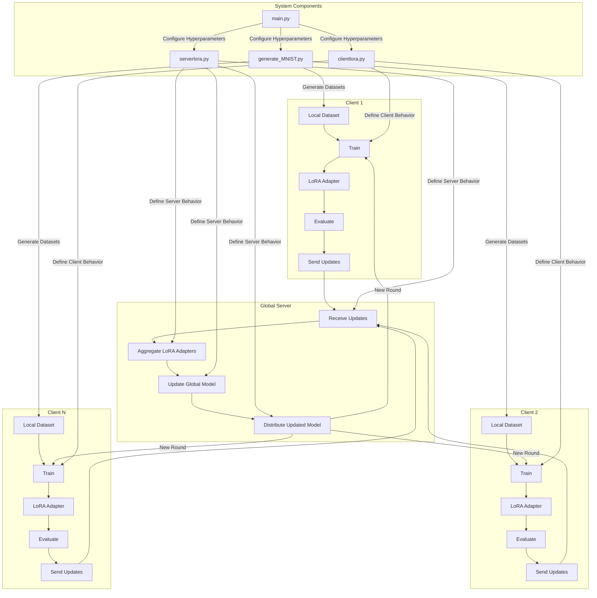

Here's an updated README for the PFLoRA-lib repository:

# PFLoRA-lib: Personalized Federated Learning with LoRA Algorithm Library

[](https://www.gnu.org/licenses/old-licenses/gpl-2.0.en.html)


Figure 1: An Example for FedAvg. You can create a scenario using `generate_DATA.py` and run an algorithm using `main.py`, `clientNAME.py`, and `serverNAME.py`.

PFLoRA-lib is a user-friendly algorithm library with an integrated evaluation platform for federated learning (FL) research, focusing on personalization and efficiency using Low-Rank Adaptation (LoRA).

Mermaid diagram for a LoRA-Federal process. This diagram will include more steps and components to better represent the full process:



This detailed Mermaid diagram represents:

1. Multiple clients (1, 2, and N) with their local datasets and processes:
   - Local training
   - LoRA adaptation
   - Evaluation
   - Sending updates to the server

2. The global server's processes:
   - Receiving updates from clients
   - Aggregating LoRA adapters
   - Updating the global model
   - Distributing the updated model back to clients

3. The system components:
   - `generate_MNIST.py` for dataset generation
   - `clientlora.py` for defining client behavior
   - `serverlora.py` for defining server behavior
   - `main.py` for configuring hyperparameters and orchestrating the process

4. The flow of data and control between these components

5. The cyclic nature of the federated learning process, with the updated model being sent back to clients for a new round of training

This diagram provides a more comprehensive view of the LoRA-Federal process, showing both the high-level federated learning cycle and the specific components involved in implementing it with LoRA adaptations.

## Key Features

- **34 FL algorithms**: Traditional FL (tFL) and Personalized FL (pFL)
- **3 scenarios and 20 datasets**
- **LoRA integration**: Efficient personalization for large-scale models
- **Low resource requirements**: Can simulate 500 clients on one NVIDIA GeForce RTX 3090 GPU with only 5.08GB GPU memory
- **GPU memory usage tracking**
- **Differential Privacy (DP) support**
- **DLG attack and PSNR metric** for privacy-preserving evaluation

## New LoRA-based Algorithms

- **hetLoRA**: Heterogeneous LoRA for personalized federated learning
- **homoLoRA**: Homogeneous LoRA for standard federated learning

## Supported Algorithms

### Traditional FL (tFL)

- FedAvg, SCAFFOLD, FedProx, FedDyn, MOON, homoLoRA, FedGen, FedNTD

### Personalized FL (pFL)

- FedMTL, FedBN, Per-FedAvg, pFedMe, Ditto, APFL, FedFomo, FedAMP, FedPHP, APPLE, FedALA, FedPer, LG-FedAvg, FedRep, FedRoD, FedBABU, FedGC, FedCP, GPFL, FedGH, DBE, hetLoRA, FedDistill, FML, FedKD, FedProto, FedPCL, FedPAC

## Datasets and Scenarios

- **Label skew**: MNIST, EMNIST, Fashion-MNIST, Cifar10, Cifar100, AG News, Sogou News, Tiny-ImageNet, Country211, Flowers102, GTSRB, Shakespeare, Stanford Cars
- **Feature shift**: Amazon Review, Digit5, DomainNet
- **Real-world/IoT**: Omniglot, HAR, PAMAP2

## Getting Started

1. Install CUDA and conda
2. Create environment: `conda env create -f env_cuda_latest.yaml`
3. Clone the repository: `git clone https://github.com/chenxingqiang/PFLoRA-lib.git`
4. Build evaluation scenarios (see Datasets section)
5. Run evaluation:
   ```
   cd ./system
   python main.py -data MNIST -m cnn -algo FedAvg -gr 2000 -did 0
   ```

## Practical Situations Simulation

- Client dropout: `-cdr`
- Slow trainers: `-tsr`
- Slow senders: `-ssr`
- Network TTL: `-tth`

## Extensibility

Easily add new:
- Datasets
- Algorithms
- Models (including LoRA adapters)
- Optimizers

## Citation

If you use PFLoRA-lib in your research, please cite the relevant papers:

```
@inproceedings{zhang2023fedala,
  title={Fedala: Adaptive local aggregation for personalized federated learning},
  author={Zhang, Jianqing and Hua, Yang and Wang, Hao and Song, Tao and Xue, Zhengui and Ma, Ruhui and Guan, Haibing},
  booktitle={Proceedings of the AAAI Conference on Artificial Intelligence},
  volume={37},
  number={9},
  pages={11237--11244},
  year={2023}
}

@inproceedings{Zhang2023fedcp,
  author = {Zhang, Jianqing and Hua, Yang and Wang, Hao and Song, Tao and Xue, Zhengui and Ma, Ruhui and Guan, Haibing},
  title = {FedCP: Separating Feature Information for Personalized Federated Learning via Conditional Policy},
  year = {2023},
  booktitle = {Proceedings of the 29th ACM SIGKDD Conference on Knowledge Discovery and Data Mining}
}

@inproceedings{zhang2023gpfl,
  title={GPFL: Simultaneously Learning Global and Personalized Feature Information for Personalized Federated Learning},
  author={Zhang, Jianqing and Hua, Yang and Wang, Hao and Song, Tao and Xue, Zhengui and Ma, Ruhui and Cao, Jian and Guan, Haibing},
  booktitle={Proceedings of the IEEE/CVF International Conference on Computer Vision},
  pages={5041--5051},
  year={2023}
}

@inproceedings{
  zhang2023eliminating,
  title={Eliminating Domain Bias for Federated Learning in Representation Space},
  author={Jianqing Zhang and Yang Hua and Jian Cao and Hao Wang and Tao Song and Zhengui XUE and Ruhui Ma and Haibing Guan},
  booktitle={Thirty-seventh Conference on Neural Information Processing Systems},
  year={2023},
  url={https://openreview.net/forum?id=nO5i1XdUS0}
}
```

For more information and detailed usage instructions, please refer to the [full documentation](https://github.com/chenxingqiang/PFLoRA-lib).
